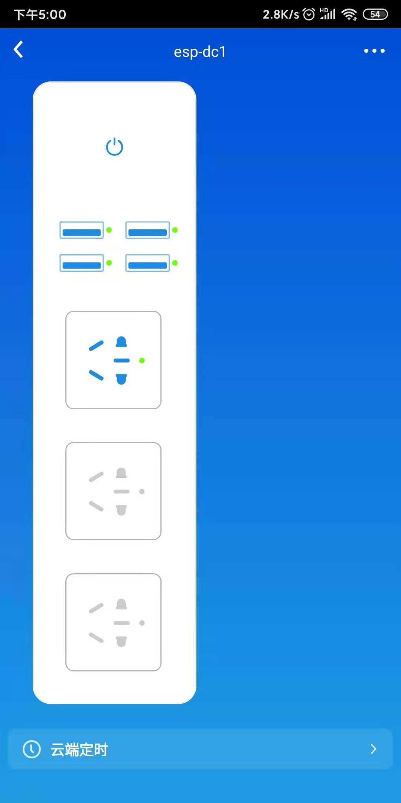

# ESP_ALIYUN_DC1
## 将斐讯DC1排插接入阿里云生活物联网平台

斐讯DC1智能排插，由于某些原因斐讯公司的服务器已经关闭，官方app已经无法再使用。排插失去远程控制的功能，所以价格也沦为普通排插的价格。但是可以接入阿里云生活物联网平台实现远程控制。

 

1. 使用RTOSv3.2
2. 完成基本控制功能
3. 有时间再完善

### 其他平台
1. [机智云(NONOS_SDK)](https://github.com/HoGC/ESP8266_Gizwits_DC1)
2. [通用MQTT平台(NONOS_SDK)](https://github.com/HoGC/ESP8266_MQTT_DC1)